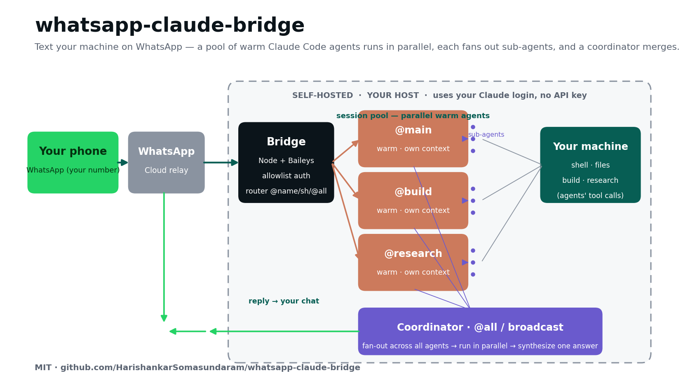

# whatsapp-claude-bridge

Drive **Claude Code** (or a plain shell) on your own machine from **WhatsApp**. Text your homelab/server in plain English — it runs commands, inspects files, builds, researches, and reports back — from a **pool of persistent, warm agents that run in parallel** (`@build`, `@research`, …), with a coordinator that merges their work. No per-message cold start.

Self-hosted, no cloud middleman, no API key: it links a spare WhatsApp account with [Baileys](https://github.com/WhiskeySockets/Baileys) and pipes messages into the Claude Code CLI using **your existing Claude login**.



---

## ⚠️ Security — read this first

This tool gives a WhatsApp chat **full command execution on the host**, and runs Claude with `--dangerously-skip-permissions` (no per-action prompts). That is the whole point, and it is dangerous:

- **The allowlist (`WA_ALLOWED`) is the only authentication.** Anyone who can post from an allowlisted WhatsApp identity can run anything on your machine.
- If the bot's WhatsApp account or an allowlisted account is compromised, **your host is compromised.**
- Run it only on a machine **you own and are willing to expose to yourself**, for a **tightly scoped allowlist** (ideally just you).
- Destructive commands (`rm -rf`, `mkfs`, `reboot`, …) are gated behind a `CONFIRM` reply, but this is a speed bump, **not** a security boundary.
- Consider running as a **low-privilege user** without passwordless sudo.

No warranty. You are responsible for what you connect it to.

---

## How it works

1. **Baileys** links a WhatsApp account (the "bot") to this process as a linked device (one-time QR scan).
2. You message the bot from your **own** number; the bridge checks the sender against `WA_ALLOWED`.
3. Messages route to a **pool of long-lived `claude` processes** (stream-json over stdin/stdout) — warm, so no cold start, each with its own context.
4. **Named agents run in parallel** (`@build`, `@research`, …); `@all`/`broadcast` fans one task across them and a coordinator merges. Each agent can itself fan out sub-agents for a single task.
5. Shortcuts and `sh <cmd>` bypass Claude for instant shell output.

See **[TECHNICAL.md](TECHNICAL.md)** for the concurrency model and full command reference.

## Prerequisites

- **Node.js ≥ 18**
- **[Claude Code CLI](https://docs.claude.com/en/docs/claude-code)** installed **and logged in** (`claude` — a subscription login works; no API key needed). Verify with `claude -p "say hi"`.
- A **spare WhatsApp account** for the bot (a second number/SIM). You command it from your primary number, so the two must differ.

## Setup

```bash
git clone https://github.com/HarishankarSomasundaram/whatsapp-claude-bridge
cd whatsapp-claude-bridge
npm install
cp .env.example .env      # then edit .env (see Configuration)
node index.js
```

On first run it prints a QR to `qr.png` (and logs the path). On the **bot's phone**: WhatsApp → **Settings → Linked Devices → Link a Device** → scan `qr.png`.

**Finding your allowlist ID:** WhatsApp now identifies senders by a **LID** (e.g. `1234567890123456@lid`), not the phone number. Leave `WA_ALLOWED` empty at first, message the bot, and the console logs `ignored msg from <id>` — copy that `<id>` into `WA_ALLOWED`, restart, done.

### Run as a service (recommended)

See [`wa-bridge.service.example`](wa-bridge.service.example) for a systemd unit (auto-restart, boot persistence, and the IPv4 fix below).

## Configuration (`.env`)

| Variable | Default | Purpose |
|---|---|---|
| `WA_ALLOWED` | *(empty)* | Comma-separated sender IDs allowed to command the bot. **Required.** Empty = ignore everything. |
| `CLAUDE_BIN` | `claude` | Path to the Claude Code CLI (must be logged in). |
| `CLAUDE_MODEL` | `sonnet` | `sonnet` (balanced) · `haiku` (fastest) · `opus` (most capable). |
| `WORK_DIR` | `$HOME` | Working dir for Claude + shell. Put a `CLAUDE.md` here for standing instructions. |
| `TURN_TIMEOUT_MS` | `240000` | Per-message Claude timeout; a stuck turn restarts the session instead of blocking. |
| `SHELL_TIMEOUT_MS` | `300000` | Timeout for `sh`/shortcut commands. |

## Commands (from WhatsApp)

| You send | Effect |
|---|---|
| *plain English* | Turn on `@main` (runs tools, fans out sub-agents, remembers context) |
| `@<name> <task>` | Turn on a named agent — created on first use; **agents run in parallel** |
| `@all <task>` · `broadcast <task>` | Fan one task across all active agents, then **merge** via the coordinator |
| `agents` | List agents + model + state · `stop <name>` ends one |
| `@<name> reset` · `reset` | Fresh context for that agent (`reset` = `@main`) |
| `use haiku`/`sonnet`/`opus` | Default model for new agents · `@<name> use <model>` for an existing one |
| `sh <cmd>` | Raw shell command, instant (skips Claude) |
| `gpu` · `disk` · `mem` · `uptime` | Instant shortcuts (edit `SHORTCUTS` in `index.js`) |
| `CONFIRM` | Approve a pending destructive shell command |
| `help` | Command list |

## Troubleshooting

- **The WhatsApp socket times out / won't connect (code 408), or downloads hang:** your host's **IPv6 egress is likely broken**. Force IPv4 — run with `NODE_OPTIONS=--dns-result-order=ipv4first` (the systemd example sets this).
- **"can't link new devices right now":** WhatsApp rate-limits repeated link attempts — wait ~15–30 min and try once, cleanly.
- **Bot ignores you:** your sender LID isn't in `WA_ALLOWED` — check the console for `ignored msg from <id>`.
- **Replies are slow:** you're probably on `opus`; send `use sonnet` or `use haiku`. The warm session removes cold-start; model choice is the rest.

## Notes

- Each **named agent** keeps its own context and serializes its own turns; **different agents run in parallel**. `stop`, `reset`, or a model switch affects only that agent.
- A `CLAUDE.md` in `WORK_DIR` becomes the bot's standing instructions — handy for host-specific context, guardrails, or a shared notebook with another Claude.

## License

MIT © Harishankar Somasundaram
